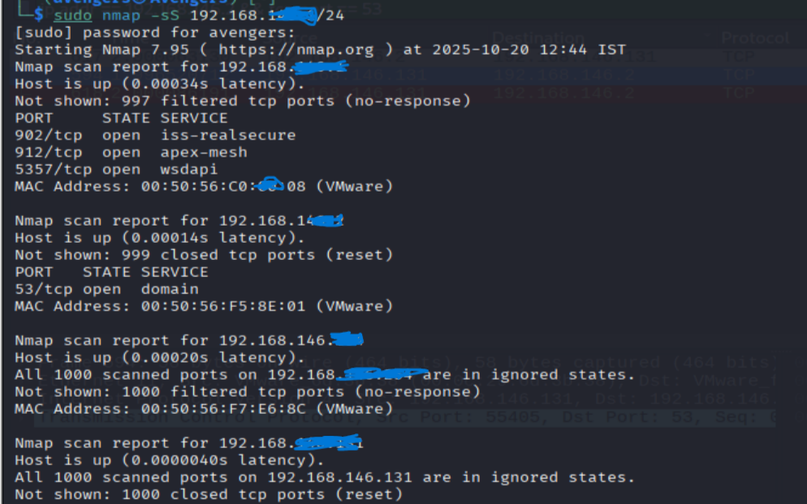
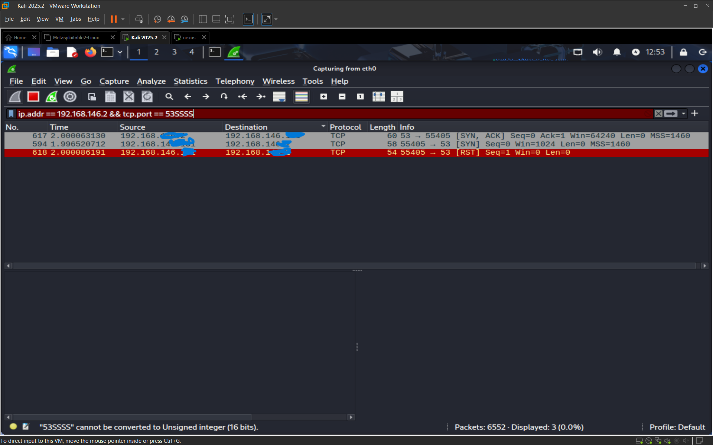

# Task 1: Scan Your Local Network for Open Ports

## Objective
The objective of this task was to discover open ports on devices within the local network using Nmap and to understand the potential security risks associated with them.

## Tools Used
* Nmap
* Wireshark (for optional analysis)

## Steps Followed (as per guide)
1.  Installed Nmap and identified the local IP range (`192.168.146.X/24`).
2.  Ran a TCP SYN scan using the `nmap -sS` command.
3.  Noted the IP addresses and open ports that were discovered.
4.  Researched the services running on the open ports and their potential security risks.
5.  Saved the scan results to a text file.
6.  **Optional**: Performed packet-level analysis with Wireshark to verify the Nmap scan results.

## Findings from Nmap Scan
The scan identified two active hosts with multiple open ports.

#### Device 1: `192.168.146.X`
* Port 902/tcp, 912/tcp, 5357/tcp

#### Device 2: `192.168.146.X`
* Port 53/tcp (DNS)

## Potential Security Risks
* **Port 53 (DNS)**: An open DNS port can be exploited for **DNS Amplification (DDoS) Attacks** or **DNS Cache Poisoning**, which can redirect users to malicious websites.
* **Port 5357 (WSDAPI)**: This port is used for network discovery. If exposed on an insecure network, an attacker could leverage it to easily map out devices on the network.

## Packet-Level Verification with Wireshark
To verify Nmap's findings, I used Wireshark to analyze the network packets during the scan. The screenshot below clearly shows the `[SYN]` and `[SYN, ACK]` packet exchange, confirming that Port 53 is open.

